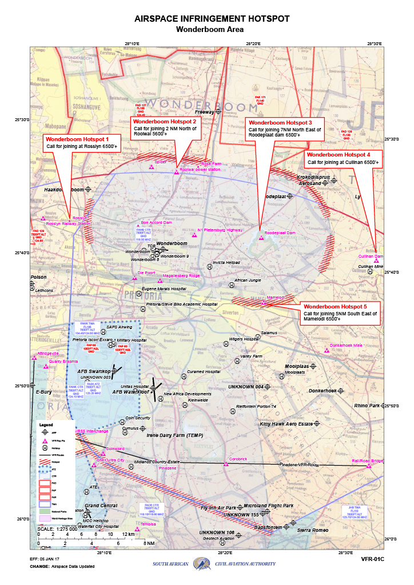

# Tower

The responsibility of Tower at Wonderboom falls to the dedicated Tower ATS unit, Wonderboom Tower (FAWB_TWR) on 118.350. TWR will be responsible for the movements on the runway, as well as the responsibility of ensuring safety amongst VFR aircraft operating in the circuit or within the Wonderboom CTR from GND - 7600ft MSL.

!!! note
    As the frequency for departure is already handed in the IFR clearance, handoffs to the next ATS unit (Johannesburg Radar) is not required with departing aircraft.

## Visual Flight Rules (VFR) Aircraft

| Type | Circuit Altitude |
| :---------: | :---------: |
| Jet | 5600ft |
| Turbine | 5600ft |
| Piston | 5100ft |
| Helicopter | 4800ft |

| Runway | Direction |
| :---------: | :---------: |
| 29 | Right hand |
| 24 | Right hand |
| 11 | Left hand |
| 06 | Left hand |  

!!! info "Circuit Clearance"
    ZSABC, hold position, after departure Runway XX, L / R hand circuits, not above XXXXft, report L / R downwind Runway XX.

!!! info "Circuit Clearance (Non STD)"
    ZSABC, hold position, after departure Runway XX, non standard L / R hand circuits, not above XXXXft, report non standard L / R downwind Runway XX.

### VRPs

### VFR Runway Departures / Arrivals

!!! warning
    There are no standard VFR routings within the Wonderboom CTR. Instead pilots must call for joining from the VRPs displayed on the VRP map.

!!! info "Entering the CTR"
    ZSABC, cleared to enter the Wonderboom CTR not above altitude 5600ft, report L / R downwind runway XX / report "VRP".

!!! info "Leaving the CTR"
    ZSABC, hold position after departure runway XX, cleared to leave the Wonderboom CTR to the N / S / E / W, not above altitude 5600ft, report leaving the CTR / report "VRP".

# Johannesburg Special Rules Area

The Johannesburg Special Rules areas are regulated pieces of airspace which lie below the Johannesburg and Waterkloof TMAs. Aircraft operating within the Joburg SRAs are required to abide by the following rules when above altitude 6500ft:

## Altitudes to fly
- **Northbound (270° to 089°)** — **7500ft**
- **Southbound (090° to 269°)** — **7000ft**

## General Operating Rules
- Less than 180kt  
- Landing Lights on

## Special Rules Areas
The Wonderboom CTR borders two Special Rules Areas:

| Special Rules Area | Frequency |
|-------------------|-----------|
| West              | 125.8 MHz |
| East              | 125.4 MHz |

 **Note for VATSIM:** For VATSIM purposes, all aircraft must be instructed to broadcast on 122.800 MHz.

## Wake Seperation

### Arrivals (nm)
| Lead  | J | H | M | L |
| :---------: | :---------: | :---------: | :---------: | :---------: | 
| J     | ||||
| H     | 6 | 4 | ||
| M     | 7 | 5 | 5 | |
| L     | 8 | 6 | 5 | 5 |

### Departures (mins)

| Lead  | J | H | M | L |
| :---------: | :---------: | :---------: | :---------: | :---------: | 
| J     | ||||
| H     | 2 | |||
| M     | 3 | 2 | ||
| L     | 3 | 2 | 2 | |

## Takeoff Phraseology

!!! info "Takeoff (Full Length)"
    ZSABC, Runway XX full length, wind 080 degrees at 9 knots, cleared for takeoff, bye bye.

!!! info "Takeoff (Intersection)"
    ZSABC, Runway XX at XX, wind 080 degrees at 9 knots, cleared for takeoff, bye bye.
