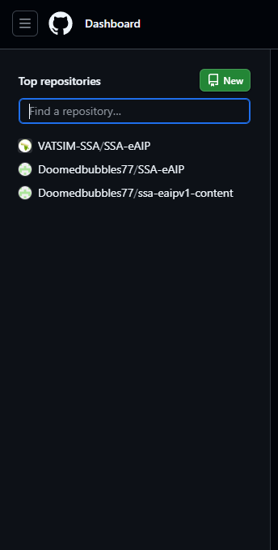
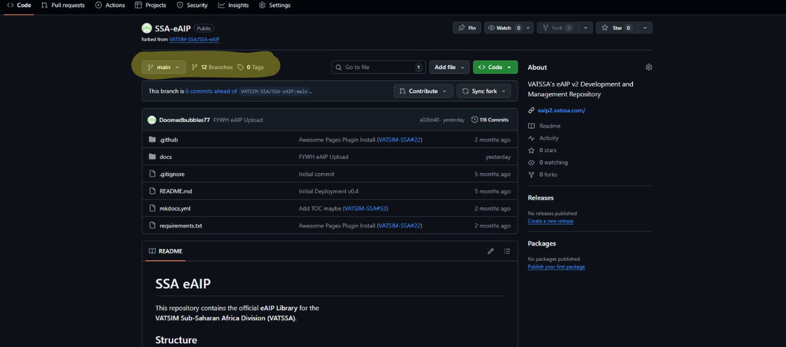
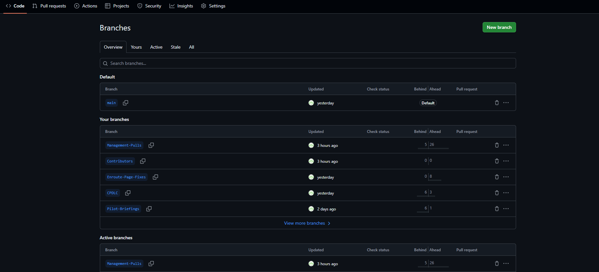
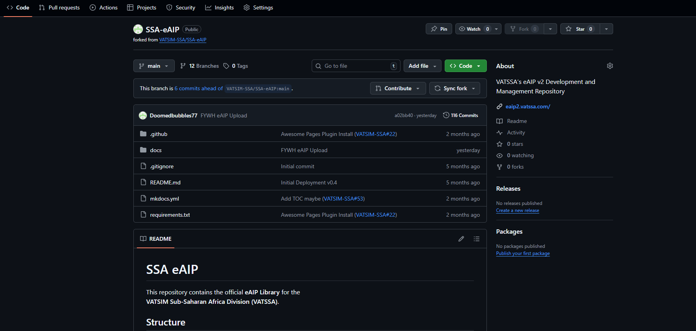
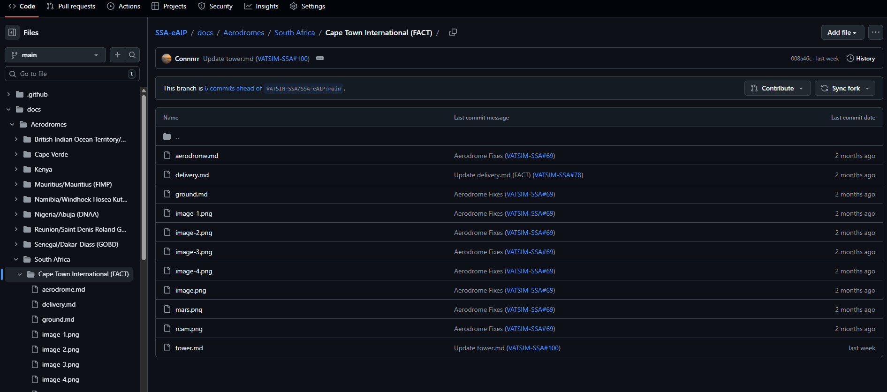
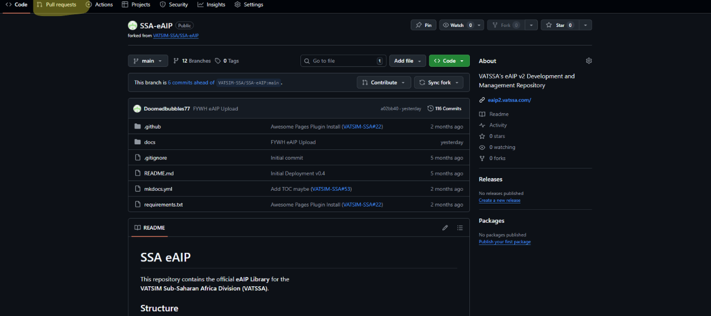
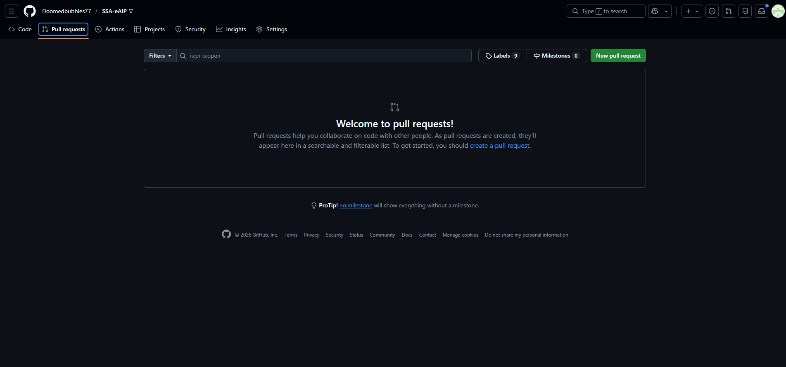
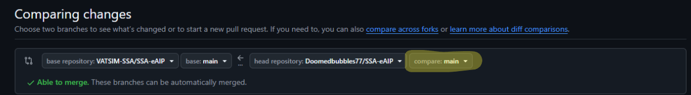
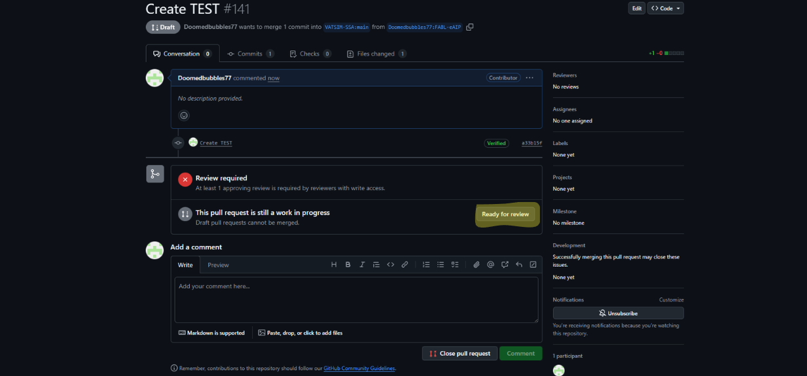

# Getting Started 

We have created a helpful user guide below in order to streamline our contributor onboarding process.

Please follow each step carefully to ensure your first Pull Request is succesful.

## What is an eAIP
eAIP stands for **electronic Aeronautical Information Publication**. VATSSA models our AIP to reflect real world procedures across the entirety of the VATSIM Sub-Saharan Africa Division. 

## Our eAIP

The VATSSA eAIP is an easy to use website hosted on Github. All files are formatted as MKDocs. MKDocs formatting can be tricky to learn at first. The best way to learn it by using our Aerodrome Formats page, which can be found [here](https://eaip2.vatssa.com/Contributing/eAIP/Aerodrome%20Formats/aerodrome/).

You can also view the MKDocs Admonitions [here](https://squidfunk.github.io/mkdocs-material/reference/admonitions/).

## Github Setup

- Start by accessing our Github [here](https://github.com/VATSIM-SSA/SSA-eAIP).

- It is a good idea to have a look through the different folders and familiarize yourself with the layout of the eAIP. 

- Now we are going to "fork" the eAIP. Forking allows us to edit our own copy of the eAIP without changing anything on the main eAIP.

- Now that you have created your own repository, we can start to make edits.

- Head back to the Github home page, and you should see your fork of the eAIP. We call this a "repository."

- Now we can head over to our repository and start making changes.

## Branches

- It is important to use branches when making edits to the eAIP. If you don't use them all, your edits will be combined into one large pull request, which is rather unclear. 

- You should label each branch clearly.

- Now when you send in a pull request, it will display the correct files to the maintainers.

- To create a new branch, navigate to the branch page on your repository.

- Now click on the main icon and view all branches.

- Now click "New Branch" and name it the relevant change. For example, if you were creating the FABL eAIP, you would name it FABL-eAIP.

- Now you can safely make changes to your repository in stages, without creating one very long PR to be reviewed.

## Making Changes

- Let's start by heading over to our repository.

- We will do a simple edit to the FACT eAIP.

!!! warning 
    Make sure you have changed your branch to the correct one. In this scenario we would name it something along the lines of FACT-eAIP.

- To navigate to FACT, we will go through docs, Aerodromes, South Africa, and Cape Town International (FACT).

- We will edit the "aerodrome.md."

- To do so, click code and then the pen icon to edit the file.

- Now we can change the code to make any relevant changes. 

!!!warning
     Please refer to MKDocs if you are unsure of any edits you make. The best way to tell if it has been formatted correctly is through the preview mode. Please be aware any warning or info sections won't load in the preview mode; however, tables will.

## Pull Requests

- Now that we have made an edit, we need to request to change it in the head repository. 

- Once your changes are saved, whilst remaining in your repository, we can click the "Pull requests" button in the hotbar.

- Now we have the pull requests page open. We can click "New pull request" in the top right.

- Now we have to select the correct branch to submit.

- Click on the "compare:main" button. We can now select the branch we want to submit. In our case we have been using "FACT-eAIP." So select the branch labeled "FACT-eAIP." 

- We can now click the "Create pull request." 

- A new window will open. In this window we can change the title and add a description.

- It is important you try your very best to provide an accurate and detailed description of what change you have made.

- As well as this, please provide a relevant title. In this case we will use "FACT eAIP Update." We would also add a short line about what we changed in the title. If we changed VFR procedures, we would say "FACT eAIP VFR procedures update."

- We can now press the "Draft pull request" button.

- You can then scroll down and click "Ready for review."

- Once you click "ready for review," your pull request will be submitted to the head repository.

- Now a maintainer will review it and merge the changes.

Well done!! You have now completed your first edit to the eAIP. Soon enough it will be merged to the head repository, and you can see your changes come to life on the VATSSA eAIP.

## Conclusion

Congratulations!! Your first PR has now been submitted for review. Throughout this guide you have gone from 0 GitHub knowledge to your first edit. DUring the guide we focused on an aerodrome page edit. Specifically FACT. However, we have other sections which require maintanence and improvements. For example, our Pilot Briefings section and our Enroute section. As we start to build up the contributing section you will notice more and more guides appearing for each page. The guides are kept simple. PRs are the same process as above. We have simply provided the formats, useful links and any important info. So, take your pick. There is plenty of work to be done. 

If you are unsure of where to start, check the issues page on the eAIP GitHub [here](https://github.com/VATSIM-SSA/SSA-eAIP/issues).

## Help

It is very important to note that this is a tricky process and you may make mistakes. However, the great part about GitHub is that your changes are fully reversible. At no point should you feel worried about any changes you submit.

The best way to get help is to ask. The best place for that is the VATSSA Community Discord; a link can be found [here](https://community.vatsim.net/).

The best place to ask is inside the eAIP Contributors Chat. To gain access to this, you are welcome to open a membership ticket at the SSA Help Desk or message VATSSA2 or VATSSA7.

